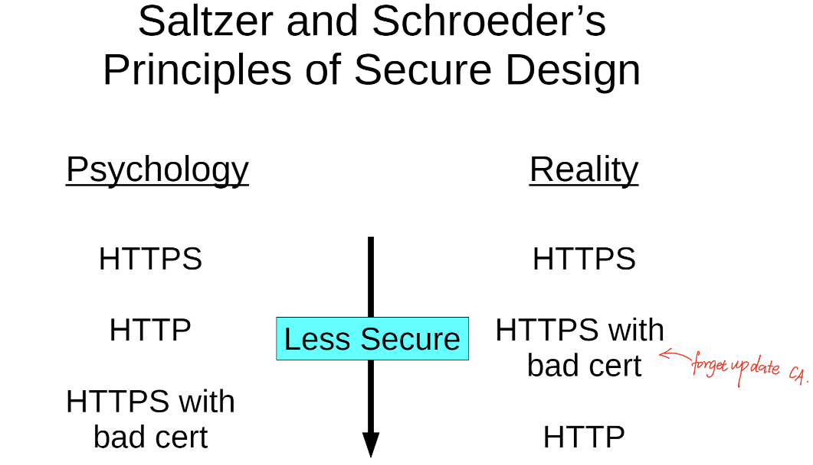
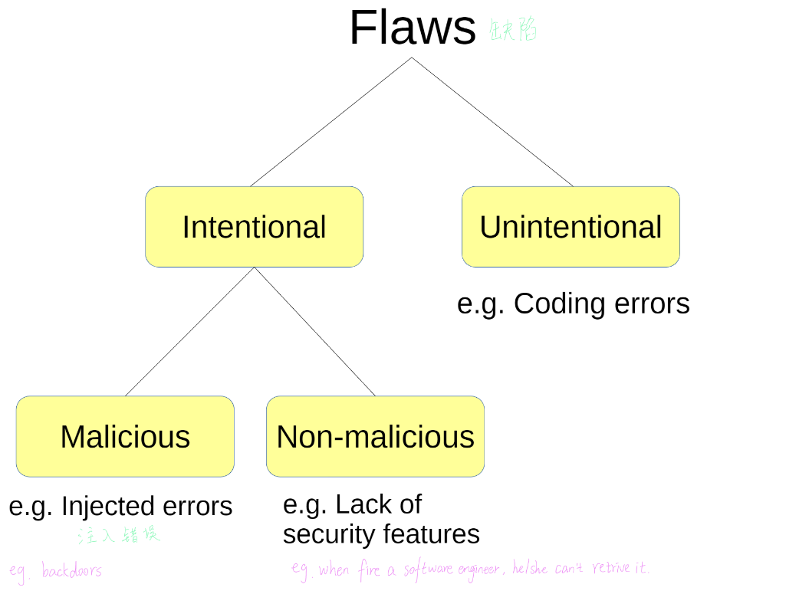

# Cybersecurity

## Module 1 principles of cybersecurity

 The security related to computers or computer network

Cybersecurity 分为两个部分

- Security- Protection of assets，system,secrets
- Privacy- Protection of identity, behavior, expression
  - 表达的权力
  - 选择how people see you的权利
  - control info about you的权利

security的价格是昂贵的

### Principles of CIA

##### Confidentiality 机密性

Information is secret

The ability of a system to ensure that an asset is viewed only by authorized parities

例子：

- password被盗
- 如果一个hacker没有阅读secret info，但是他们有这么做的priviledge，这个会被认定成违反机密性吗？答案是不违反。具体来说比如他们可能得到你系统的root，and they‘re using it to make your computer a bot for the botnet, rather than your  secret info that would violate Integrity
- Eavesdropper窃听者在玩家登录时capture 账号和密码

##### Integrity 完整性

Information/System is correct

The ability of a system to ensure that an asset is modified only by the authorized parities

例子：

- 密码被篡改
- Man-in-the-middle: Attacker 代替用户和系统连接
- 钱被偷（online），但是如果是用户forced to shut down的servise则是违反了availability

##### Availiability 可用性

system is usable

The ability of a system to ensure that an asset can be used by any authorized parties ，有些时候可用性和前两项是不可分割的，尤其是完整性，在很多情况下完整性被影响就会影响到可用性

例子：

- 密码被篡改
- Man-in-the-middle ，导致用户无法通过自己的密码登录系统

**Perfect CI** is achieveable by shutting down the system, not allowing anybody to access it (not available to anyone)

=> CIA principle is a tradeoff between C,I,A

###### DDOS 分布式拒绝服务攻击

多个不同machines被用一个攻击者控制，攻击相同的services- 这种情况违反了avaliablity

攻击者使用了一个通过猜测微不足道的远程访问密码创建的僵尸网络 the attacker used a botnet that was created by guessing trivial remote access passwords- 这种情况违反了integrity， 物联网设备加入僵尸网络，这些设备的所有者不应该这样做（不违反机密性：usename&password不包含任何机密信息b/c这些物联网没有要求用户更改默认用户名和密码）


Assets: the items you value. There are  many types of assets involving hardware,sofeware,data,people processes pr conbinations of these.

Assets' values are personal ,time dependent, and often imprecise. 不精确的


###### Vulnerabilities 漏洞

如果你不知道用户的需求，你就无法证供的从创建一个成功的安全系统

分为两种情况

- Design
  - Wrong threat model: misunderstand, where the attacker come from(少见，因为公司的安全团队会防范)
    - 可以通过社会工程学攻击
  - Wrong user model: misunderstand what users are doing/who is the user
    - eg: giving administrative permission 比如在操作时软件申请root权限，很少有人会拒绝
  - 以上这两点did not design for security
- Implementation
  - 代码，硬件，网络等出现错误

Spiderman Rule： 能力越大责任越大

###### Privacy

- 隐私性不同于confidentiality ,我的理解是privacy是个人信息相关，而confidentiality是non-private的信息
  - 违反隐私的情况是： Welcome back ,customer. last week yoy purchased......(shopping list)
  - 违反confidentiality的情况是：Welcome back ,customer. As a reward,please use this gift code for your next purchase， 在这种情况下gift code 不是private or personal info
- The connectuon between Information and Identity
  - issues(human issues): expression, socla vulnerability,  behavorial analysis, discrimination判别
  - Protections： Anonymization匿名，disassociation分离（解除动作与人的关联disassociating the action with the perso），security


##### Defensive Strategy

Risk Management: A risk is something that could damage, destory,or disclose公布 data

Essential for convincing upper management to adopt security countermeasures对说服高层管理层采取安全对策至关重要

###### Quilitative Risk Analysis

- 每个公司的衡量标准不一样， what sort of indestry that you're looking at

###### Quantitative Risk Analysis

For any given risk ，都需要计算SLE单一损失预期

- SLE： Single loss expectancy= Asset Value* Exposure Factor曝光系数(% of assents exposed to the risk)

然后计算公司的ALE年化预期损失

- ALE： annual loss expectancy= SLE* annualized rate of occurrence

If you proposed countermeasure can reduce ale more than the cost of the countermeasure如果您提出的对策可以减少ale，而不是对策的成本就很好

### Principles of Secure Design

###### Security by design

Security （还有漏洞）should be sonsidered starting from the design phase 结算

- 如果在设计阶段没有设计安全性，那么在之后添加将会是非常困难的，因为在此之前攻击就有可能产生了
  - might not integrited with the design
  - the modeling might be poor
  - cannot add security later b/c the producted already shipped
  - sms 是未加密的（not encryption）

### Saltzer and Schroeder's Principles of secure design

##### * Open Design

  the system's design should be openly to everyone

The design should not be secret. The mechanisms should not depend on the ignorance of potential attackers, but rather on the possession of specific, more easily protected, keys or passwords. This decoupling of protection mechanisms from protection keys permits the mechanisms to be examined by many reviewers without concern that the review may itself compromise the safeguards.

- The secrets should not be in design (algorithm, how we allow people to login, how we authenticate people who are logging in), but can be the password, encryption keys
- 与隐蔽性的安全相反opposite of security through obscurity默默无闻
  - hide detials of the implementation to prevent comprromising analysis隐藏实现细节以防止入侵分析

    - reserve engineering- taking the product,then figutr out how it was made(ie source code
    - 通常不会生效因为reserve engineering的存在
    - 有时生效的原因是exposing details make the product more attractive to hackers
  - Examples of security through obsurity隐蔽的安全

    - Terms of service+ lawsuits barring reverse engineering 禁止诉讼
    - cryptosystems where the algorithms are secret 算法保密的密码系统
    - gag order禁言令- people were forbidden to talk about the lawsuits and their research
- Linus Torvalds law- Given enrough eyeballs, all bugs are shallow
  - 但是也会出现开源代码没有人检查的情况比如： Heartbleed - serious open- source software bug
    - can steal the memory of any machine on the internet

##### * Economy of Mechanism

在这里的economy指的是 efficiency/simplicity

The system should be simple enough to undersatnd and analysis

但它值得强调保护机制，原因是：在正常使用过程中不会注意到导致不需要的访问路径的设计和实现错误

- KISS 原则： Keep it simple/stupid
- 对安全分析有帮助
- 鼓励好的设计
- Complicated solutions are bypassed by simple workarounds复杂的解决方案被简单的变通方法所绕过 ex: Juicero

##### * Least common Mechanism 最少相同机制

Minimize the amount of mechanism common to more than one user and depended on by all usersThe amount of share 应尽量减少所有用户所依赖的共享机制数量

最少通用机制 (LCM) 的目标是管理错误和成本。大多数有用的计算机系统都带有大型可共享代码库，以帮助程序员和用户使用常用的功能。（这些库所包含的内容这些年来急剧增长。）这些库是代码的集合，以及必须由某人编写和调试的代码。编写安全代码既困难又昂贵。编写可以有效保护自己的代码是一项挑战，如果系统充满了以特权运行的大型库，那么其中一些库将存在暴露这些特权的错误。

- 最小化伤害， damage can be covered much more easily
- Examples for web hosting
  - use mutiple data centers
  - backup your database
  - localize computations 计算机本地化
    - Do not use all computations on the same deviices
    - 比如C语言的标准数据库中就存在很多不好的函数：no bounds checking

##### * Least Privilege 最小特权

每个程序和系统的每个用户都应该使用完成工作所需的最少权限集进行操作 Every program and every user of the system should operate using the least set of privileges necessary to complete the job.

该原则限制了事故或错误可能导致的损害。它还将特权程序之间的潜在交互次数减少到正确操作的最低限度，从而不太可能发生无意的、不需要的或不正确的特权使用。因此，如果出现与滥用特权有关的问题，则必须审计的程序数量将被最小化

##### * Separation of Privileges

  The system should grant permission based on mulitiple conditions

在可行的情况下，需要两把钥匙才能解锁的保护机制比只允许访问者只需一把钥匙的保护机制更加稳健和灵活。

- 比如2-step verification

##### * Complete Mediation 完整的调节

All accesses should be checked

必须检查对每个对象的每次访问权限。当系统地应用这一原则时，它是保护系统的主要基础。它强制访问控制的系统范围视图，除了正常操作外，还包括初始化、恢复、关闭和维护。

- Login to system -> view grades -> find file 这每一步都需要mediation
- 跟TOCTTOC， cookie Manipulation相关

##### * Fail- safe defaults

Upon failure, the system should revert to a secure default 一旦失败，系统应恢复到 到一个安全的默认值

- POODLE (Padding Oracle on Downgraded Legacy Encryption): 在降级的遗留加密上填充oracle
  ●SSL被更新为TLS，以消除一个填充Oracle漏洞
  ● 客户端可以迫使服务器再次降级为SSL
  ● 难以修复，因为一些客户确实没有 更新到TLS

##### * Psychological Acceptability

Security should be intuitive to the human psyche.

安全方面的大多数问题并不涉及如此重要的选择，但都必须与心理可接受性测试进行权衡。



##### * Work factor

Consider how much effort an attacker needs to expend to attack the system.考虑攻击者需要花费多少精力来攻击该系统。

##### *  Compromise recording妥协记录

Always record compromise events.有时会有人提出，可以用可靠地记录信息泄露事件的机制来代替完全防止损失的更复杂的机制。

###### 几个例题：

- 为了将他的个人资料放在系统上，以便绕过生物特征测试，汤姆·克鲁斯潜入了一个水控制系统，撕掉了旧的个人资料驱动器，并插入了一个新的个人资料驱动器
  - 违反了fail-safe defaults 因为系统应该crash和等待一个人来查看有什么问题
- 一旦进入，他的搭档在首相的各个银行账户中窃取了约24亿英镑的信息
  - 违反了least-privilege 和complete mediation
- 我很害怕，所以我安装了推荐的防病毒软件。一扇窗户弹出请求管理员权限，我同意。
  - 违反了psycho acceptability和economy of mechanism（因为The antivirus is so complicated that I cant really analysis it
- 反病毒实际上是一种病毒，它利用glibc中的缓冲区溢出
  - 违反了least common mechanism

###### 一些小单词：

Compromised 遭受入侵

Eavasdropper 窃听

sms= short message service 短讯服务

cyberbully 网络欺凌, cyberstalking 网络跟踪

# Software Security

The best way to create a malware is not create malware, is to download other people's malware恶意软件



### Unintentional Flaws

分为两种

- Local application flaws
  - Buffer overread, buffer overflow, TOCTTOU
  - 缺陷存在于program‘s code，通常exploited within the same system, 通常从网络上被开发(exploited)， a pocket sends there the software reads the packet and the get hacked
- Web application flaws
  - XSS, XSRF, SQL Injection
  - code accessible from the internt
  - only exploited over the net b/c they're based on network technology,web brower technlogy
- eg:一个软件既有本地应用程序也有网络应用程序，从互联网上可以访问的代码中有一些弱点，这就导致了问题的出现

##### Buffer overread

程序从缓冲器读出数据时超出了边界

A piece of contiguous memory that  has been allocated inside of the memory for some purpose

会产生这种情况的原因是在C/C++中everything is essentially a pointer to stg, its either storing a value,or its a pointer to sth when pointing to sth, there's no boundary'

Reading memory too much won‘t cause the software to crash， 就比如说A得密码有5位 然后要求replay 100位是不会造成crash的， 只会继续阅读

Heartbleed： Memcpy(bp, pl, payload)

- bp: returned to client, memcpy doesnt add null terminator'\\0'
- pl: points to an array, memcpy itself is not able to know the size of 'pl'
- payload: supposed to be the size of that array, but user declares this
- if sth can cause a crash, then a hacker is often able to use it to do sth much worse than a crash
- Heartbeat feature: a periodic signal generated by hardware or software to indicate normal operation or synchronize other parts of a computer system 由硬件或软件产生的周期性信号，用于指示计算机系统的正常运行或同步其他部分
- heartbeat here: the user should be able to ask the serve, the way to check the server is still alive

##### Buffer overflow

缓冲区溢出，也是stack smashing（栈溢出），buffer overrun，buffer overwrite。 就是在buffer中写入太多了

```
void input_username(...){
	char username[16];
	printf("Enter username:");
	gets(username);
	...
}
```

在上面这一段代码中

- get函数：get user input, store it into username with no bounds check
- 如果用户输入20characters，代码将会尝试在username中存储所有这20个符号，这不会引发crash。
- if there're other variable next to the username, those can get overwritten
- fgets() has a boundry check, only put the required length into the variable
- malloc: pointers goes into stack, the actual array goes into the heap


这块应用性太高 明天再看

### 攻击类型

##### Tocttou

TOCTTOU(Time of Check to Time of Use)是[竞争危害](https://baike.baidu.com/item/%E7%AB%9E%E4%BA%89%E5%8D%B1%E5%AE%B3) (race hazard) 又名[竞态条件](https://baike.baidu.com/item/%E7%AB%9E%E6%80%81%E6%9D%A1%E4%BB%B6) (race condition)的一种

TOCTTOU是指计算机系统的资料与权限等状态的检查与使用之间，因为某特定状态在这段时间已改变所产生的[软件漏洞](https://baike.baidu.com/item/%E8%BD%AF%E4%BB%B6%E6%BC%8F%E6%B4%9E/3879396)。可以提高权力

In a tocttou attack, the attacker change an object between the time it is checked and the time it is used.  can used to bypass authentication, used to gain toot privileges

会在有bad programming 时发生，programmers expect one thing to happen, but other things could also happen, 若没事提前发生=》unexpect behavior

- Check: Should the user have privilege?
  - access control, check ownership
- Use: Do something for the privileged user
  - Read file,Write to file, change permissions
- 攻击者可以通过以下方式增加成功几率：
  - 在深度目录中打开文件
  - 在远程网络位置打开文件
  - 只要把握好攻击时机或不断重试即可
- 预防:
  - 锁定正在使用的对象
  - 检查标识符以后是否已更改（？）

##### XSS- Cross-site Scripting 跨网站脚本攻击

当用户可以将代码写入网页时，就会出现XSS漏洞

- Persistent XSS vulnerability
  - 用户持续更改页面内容
  - e、 g.社交媒体简介页面
- Reflected XSS vulnerability反映的XSS漏洞
  - 恶意链接（Malicious link），执行代码就像它是页面内容的一部分
  - 攻击会一直存在，只要时进入那个网站的人都会被黑
  - 点击链接的人不知道这是邪恶的
  - e、 g.窃取Cookie，伪造登录窗口，向其他用户发送消息

##### XSRF- Cross-site Request Forgery 跨站请求仿造

在XSRF中，恶意伪造链接会导致用户发出伤害自己的请求

The link itself when user click, it cause you to do an action, that action is bad for the user

XSRF 和Reflected xss vulnerability

- 共同点： both involve links,chlick links to do bad things
- 不同点：
  - 对于xsrp： invoives the server parsing user request in a way that allows sb to craft a link to carry out the request.以允许sb创建链接以执行请求的方式参与服务器解析用户请求。
  - 对于xss : exploit them in two directions
  - XSS attacks may be launched after malicious talking over a server,XSRF attacks do not attack the server; XSS攻击可能是在通过服务器进行恶意对话后发起的，XSRF攻击不会攻击服务器
  - sometimes ,XSS attacks are indeed planted into the code of the web page after the server has been taken over with malware在服务器被恶意软件接管后，XSS攻击确实植入了网页的代码中
- eg: 通过公共wifi发送虚假亚马逊页面是不属于Reflected xss vulnerability的 因为Its man in the middle spoofing attack它的中间人欺骗攻击

##### SQL injection SQL 注入

SQL代码糟糕，存在解析漏洞(paesing vulnerability)

SQL注入是一种技术，攻击者通过向数据库查询中添加一串恶意代码来获得对web应用程序数据库的未经授权访问。SQL注入（SQLi）操作SQL代码以提供对受保护资源（如敏感数据）的访问，或执行恶意SQL语句。

##### parsing Vulnerability 解析漏洞

字符和数字的分析可能不正确：

● rlogin-l-froot攻击允许以root身份远程登录

● 目标计算机收到“login-f root”

● 规范化：用多种方式表示同一个字符串；攻击者选择一种方法来避免阻塞/检测。示例：

● http://2130706433/

● 使用下载文件的特洛伊木马程序。exe%20以避免阻止exe文件

● 系统允许访问/data/user/taowang，所以您可以访问data/user/taowang/。/..//系统/

Hack game: user being able to send command to ther server when player playing actually senfing command to the server. the server must trust the user in same degree, when it gets parsed locally , you can just change the fake result to the server, but there;'s validation checking 黑客游戏：当玩家实际向服务器发送命令时，用户能够向服务器发送命令。服务器必须在同样程度上信任用户，当它在本地被解析时，您可以将假结果更改为服务器，但需要进行验证检查

### Malware

恶意软件由传播机制和有效载荷组成Malware consists of a spreading mechanism and a payload（执行恶意操作的恶意软件部分

所有的恶意软件由传播机制和有效载荷组成，但是实际上存在没有payload，他们通过用户的动作进行传播（not an automatic spreading mechanism

通过method of spread或者infection vector（感染载体）进行分类

##### Virus

以**人为操作**的方式，从一个系统传播到另外一个系统的恶意软件。人为操作，如打开E-mail附件，打开一个恶意的网站等。病毒不会主动传播，除非有人的相关动作触发。所以最好的方式是教导用户防止病毒的基本知识。

A malicious program that self-replicates自我复制的恶意程序

- it attaches itseld to a file
  - like hard disk, boot sector,
- it runs immediately when computer starts
- consists of a spreading mechanism and a payload

##### WORM &NETwork

在这学期的ppt里 老师把worm变成network了

以自动的方式，从一个系统传播到另外一个系统的恶意软件，不需要人为的操作触发。蠕虫病毒可以寻找并利用系统的漏洞，即使用户不做任何事情，系统也会被感染。一旦蠕虫感染了新的一台设备，它将以这台新的设备为基石，感染到其与之网络相连的设备。所以最好的防御方法是，保持系统为最新版本，及时打补丁。

属于不需要user action的恶意软件

- uses background programs(daemons系统服务) to soread
- inflecteds network-facing programs,也通过网络传播
- 非常迅速，因为inflection和传播都是自动的

###### Slammer Worm

- Exploits SQL Server buffer overflow using a packet使用数据包利用SQL Server缓冲区溢出
- Patch had existed after Blackhat warning黑帽警告后补丁已存在
- Generate random addresses, sends itself by UDP生成随机地址，通过UDP自行发送， 不需要做handshake，just send it out
- Infection doubled every 8.5 seconds, reached 90% of all vulnerable systems in 10 minutes感染每8.5秒增加一倍，在10分钟内达到所有脆弱系统的90%
- “Warhol worm” - Andy Warhol “In the future, everyone will be world-famous for 15 minutes”沃霍尔蠕虫”-安迪·沃霍尔“未来，每个人都将在15分钟内闻名世界”
- No payload; payload: what it does, eg： ransomware- 加密你的硬盘，向你索取钱财
- 影响; caused server congestion导致服务器拥塞

###### Blaster Worm冲击波蠕虫

- Exploits RPC （remote procedure call）buffer overflow
- Payload: DDoS windows update site; Intent目的： prevent people download a patch from windows
- Earlier warnings, patches were not installed
- (Unintentionally) shut down computers
- Welchia is a “helpful” worm that removes Blaster and force-installs patchesWelchia是一种“有用”的蠕虫，可以删除Blaster并强制安装补丁
- backhat: no permission; white hate : with permission
- when you start your computer, ina minute, you would get the pop-up window on the right, bc it was a worm that automatically spread. An infected system would also keep sending these attack packets to other computers in the same network 当你启动电脑时，一分钟后，你会看到右边的弹出窗口，因为它是一种自动传播的蠕虫。受感染的系统还将继续向同一网络中的其他计算机发送这些攻击数据包

##### 木马Trojan

“在跳舞的猪和安全性之间进行选择，用户每次都会选择跳舞的猪。”

假冒为合法的应用的一部分，当用户下载安装后，应用正常运行，但是木马程序随之幕后运行，执行一些用户不知道危险动作。最好的抵御方式是使用应用控制解决方案，其可将系统上运行的软件限制在由管理员特别批准的标题和版本中。远程访问木马(Remote access Trojans，或者称为RAT)，是木马中的一个类别，可以给黑客提供远程访问和控制被感染系统的能力。

A trojan is a piece of malware that spreads by tricking the user into activating/clicking it通过诱骗用户激活/单击它来传播

- 与有用的软件打包
- 看起来像是有用的软件（例如Android重新打包）
- 恫吓软件Scareware
- 鱼叉式网路钓 Spear phishing
  - an attempt to get people to so sth by ticking people thinks its good
  - a general phishing sttack may be "I sent you money,pleack click this link "

特洛伊木马诱骗人们运行程序，病毒仍然诱骗人们，但它不一定涉及运行程序（病毒可以影响usb密钥、软盘或驱动器）Trojan trick people to run the programs, virus still trick people, but it doesn't involve necessarily running a programs(virus can infact usb key, a floppy disk or a piece of drive)

###### ILOVEYOU attcak

- Malware in e-mail attachment:
  “LOVE-LETTER-FOR-YOU.txt.vbs”
- Destroys files on target system through replication
- Reads mailing list, sends files to them
- Downloads another trojan “WIN-BUGSFIX.EXE”
- Very easy to reprogram
- 这个既是Virus也是木马
  - Virus： 因为it replicated itself across files and attackes them to those files它跨文件复制自己，并将其附加到这些文件中
  - Torjan: bc it tricks you into running a program
- 以txt结尾的文件是不值得信任的，因为its simple, the default text editor is very unlikely to have any vulnerabilities
- if a malware attaches itself in a excel file, then you dont even know, then as a user send out thouse excel files to colleagues, that coule be a virus but not a Trajan,bc opening the excel file is a proper file, not tricked by anyone 如果一个恶意软件附着在一个excel文件中，那么你甚至不知道，然后作为一个用户向同事发送数千个excel文件，这可能是一个virus，而不是一个Trajan，打开excel文件是一个正确的文件，没有任何人欺骗

###### ByteBandit

- spreads with an inflacted floppy disk软盘
- resides in memory, even after reboot 内存长驻病毒，non-volotile memory非易失性
- inflects all inserted floppy disks弯曲所有插入的软盘, 最终会导致黑屏
- 这个也是同时被定义为virus和 trojan、

##### Planted malware植入恶意软件

由（临时）控制系统的攻击者故意安装：

● 受雇者

● 间谍活动

● 来自其他恶意软件

有时，有效载荷是一个逻辑炸弹：由特定条件引发的恶意代码

● 一段时间后

● 如果员工被解

**恶意软件按照有效载荷分类：**

##### Botnet僵尸病毒

集中控制计算机

3 parties :

- attacker- controller
- bots- computer ownerd by inocious users 无害的用户
- victim- large, someone with a lot of capacity， A Command and Control structure

前辈经验： you cant really stop them , as a private corporation, you have no real capiacity to stop them

the best you can do is to have as many security features as you can find, and make it vert well know that you're using those security features, them attackers don't bother to attack you

hijacking： 黑客获取了通讯控制权，然后通过隐藏身份使得主机相信它正在与一个可信任的对象进行通讯

Is hijacking a device for cryptomining considered being part of a botnet?- if the attacker only able to steal some cpu cycles, but can't do anything with your computer, that's not a botnet劫持加密挖掘设备是否被视为僵尸网络的一部分-？ 如果攻击者只能窃取一些cpu周期，但无法对您的计算机执行任何操作，那么这不是僵尸网络

适用于：

- 隐藏攻击源/身份
- Sybil攻击
  - make sth hot or not through social networks
  - 女巫攻击，利用社交网络中的少数节点控制多个虚假身份没从而利用这些身份控制或影响网络的大量正常节点攻击方式
  - benefit： much harder to block，dont get police after 有 unless they find out who the real master is
- 恶意软件传播
- 垃圾邮件 spam

##### Backdoors

two types：

- spread by malware

  - eg：adds an administrator privileged account to the system, and then it allows the attacker future access
  - adds a ssh to the system , so it adds a public key,the private key is owned by the attckers . so attacker can access the system in the future
- allow malware to get onto the system

  - create software vulnerabilities on your system, so next they can use those vulnerabilities to access the system, push bad binaries onto the system
  - backdoors in the system itself, it wasn't create by malware, attacker can use the backdoors to get onto that system

  -通过恶意软件传播

  -例如：向系统添加管理员特权帐户，然后允许攻击者将来访问

  -将ssh添加到系统中，因此它添加了公钥，私钥由ATTCKER拥有。因此攻击者将来可以访问系统

  -允许恶意软件进入系统

  -在你的系统上创建软件漏洞，然后他们可以使用这些漏洞访问系统，将坏的二进制文件推送到系统上

  -后门在系统本身，它不是由恶意软件创建的，攻击者可以使用后门进入该系统

允许意外访问系统

- 无法在系统上创建，因为：
  - 留作测试（故意非恶意缺陷）
  - 由恶意软件安装
  - 法律要求

##### Rootkits 提权软件包

rootkit是一种恶意软件，用于维护对目标系统（root）的命令和控制

通常隐藏在内存中，然后黏在其他进程上，one way tp dp that is comput other processes with hook injection(钩子注入： 一种进程注入)

它改变系统功能的行为以隐藏自身/其他恶意软件

- 难以移除
- 用户rootkit可以更改文件、程序、库等。
  - 在使用指令ls，dir时可以被操控
  - hardware scanner是找不打的，因为rookit会改变scanner's reading capability
- 内核rootkit可以更改系统调用
  - anti- cheating software need root access to scan all files and all processes. They tend to do more than anti- cheating

###### Sony XCP

索尼存在的rootkit

- XCP磁盘的乱码写入输出
- 隐藏所有以“sys”开头的文件和文件夹
- 最终，由于压力，索尼发布了一款卸载程序
- 当你使用cd时会让你安装XCP软件
- Any piece of malware can leverage that to attack anyone who's listened to a music CD by sony任何恶意软件都可以利用它攻击任何听过索尼音乐CD的人

###### Zip bombs, compiler bombs拉链炸弹，编译炸弹

● 破坏性有效载荷通常用于特洛伊木马

● 压缩炸弹：解压缩炸弹会创建一个非常大的文件

● 编译炸弹：编译炸弹会创建一个非常大的文件

● 除了破坏，还可以用来破坏某些扫描

##### Spyware

通过摄像头和麦克风， 秘密的收集用户data

- lots of spyware are written by gov.agencies to try to collect data from their opponent
- zero-day atattck: an attack that has never been used or found before by the general community. there's no chance to patch for the vulnerability普通社区以前从未使用或发现的攻击。没有机会修补该漏洞

###### Pegasus

应用于ios和Android的间谍网站

- 由软件公司NSO集团开发
- 阅读短信、追踪手机、启用麦克风和摄像头等。

##### Trackers（spyware的一种

spyware that don't need root

- Cookies存储有关您的信息
  - Cookies technically don't store personalized data, they store a tracking identifier, very often a cookie is just a single integer describes who you are to the web server, the web server actually stores info about you ( an identifier, when visit the website a second time, send there your identifier, then they knwo who are you ,merge your data with the old data, can launch for advertising)从技术上讲，cookie不存储个性化数据，它们存储跟踪标识符，通常cookie只是一个整数，用于向web服务器描述你是谁，web服务器实际上存储关于你的信息（标识符，当第二次访问网站时，将你的标识符发送到那里，然后他们知道你是谁，将你的数据与旧数据合并，可以启动广告）
- 第三方Cookie允许您在站点A上的操作被收集并发送到站点B（在某些浏览器上被阻止）
- 网站上的网络信标向第三方（ad）服务器发出请求，该服务器也可以自动为该服务器发送您的Cookie
- 多个站点中的信标通常链接到同一个广告服务器

##### Keylogging按键记录器

监控用户的击键

几种键盘记录器：

● 特定于应用程序的键盘记录器

● 软件键盘记录器

● 硬件键盘记录器

每个都可以秘密安装一些键盘记录恶意软件窃取您的凭据（例如“银行家”）

##### Ransomware勒索软件

encrypt the disk drive securely, he decrypt key is on their server 安全地加密磁盘驱动器，他解密的密钥在他们的服务器上

General technique:  encrypt disk, then demand ransom to  decrypt it
Disk is encrypted using public key, private key is on attacker's  own server
Attached storage media will also be encrypted
Little recourse once files are encrypted
A number of attacks fail to release keys

一般技术：加密磁盘，然后索要赎金解密

磁盘使用公钥加密，私钥位于攻击者自己的服务器上

连接的存储介质也将加密

文件加密后几乎没有追索权

许多攻击无法释放密钥

##### Stealth techniques

为了避免被检测到：

● 多态代码

● 隐藏在内存中，隐藏文件模式

● 中断扫描技术

##### Advanced Persistent Threats高级持续威胁

- Combination of multiple infection vectors and spreading strategies多种感染媒介的组合和传播策略
- Focused, long-duration attack集中、持续时间长的攻击
- Achieves political/industiral goal实现政治/行业目标

###### Stuxnet 美国政府组织

worm and virus capability

- 通过网络和USB进行传播
- 使用四次零天攻击
- 几乎在任何机器上都不做任何事情
- 但它摧毁了一种特定类型的伊朗核反应堆离心机控制器
- 推测为政府资助

###### Flame

worm and virus capability

- 间谍软件：记录击键、摄像机、屏幕，发送到远程服务器
- 由防病毒软件决定的行为
- 使用通过攻击Microsoft服务器的弱加密机制获得的假证书
- 超大（20MB
- 发现时试图擦除自身（by using kill command

##### Covert Channels 隐蔽通道

隐蔽通道是攻击者在不通知受害者的情况下用于在受监控环境中通信信息的资源（不用于通信）

- 检索被盗数据
- 接收命令
- 更新恶意软件

示例：TCP初始序列号、数据包大小、计时、端口敲

- 一种隐藏通道，允许攻击者通过某些入侵检测系统或取证系统发送MSG(法医系统)目的是在不触发受害者报警系统的情况下发送或接收消息。这个想法很像更改文件名以避免扫描仪。这正在改变MSG的发送或接收方式，以避免入侵检测系统，或避免扫描此信息。A hidden channel that allows the attacker to send msgs through some  intrusion detection system or forensic system (法医系统)The objective is to  send or receive a message without triggering( ) the victim's alarm system  The idea is very much like changing file name to avoid a scanner. This is  changing the way the msgs are sent or received to avoid an intrusion  detection system, or to avoid something that scans for this.
- Instead using a random initial sequence number choose a specific sequence number and use that to send information. Can use the size of the packets to send a secret message.取而代之的是使用一个随机的初始序列号，选择一个特定的序列号并使用它来发送信息。可以使用数据包的大小发送秘密消息。
- Port knocking:  you try to establish a connection with a specific port The port a number you can send info through that number the number  itself is information. Instead of establishing legitimate connection, trying to establish a connection with ports that don't really exist, in  order to sent that as intormation to the person who supports you are knocking端口敲击：您尝试与特定端口建立连接端口一个数字您可以通过该数字发送信息该数字本身就是信息。与其建立合法的连接，不如尝试与实际上不存在的端口建立连接，以便将其作为信息发送给支持你的人
- Packet sniffing( ) is not a covert channel, because it is someone trying to read your packets.数据包嗅探（）不是隐蔽通道，因为它是有人试图读取您的数据包。
- Covert channel is where the attacker is on two sides:  outside of your system, inside your system. The two sides want to communicate, the two  sides are woried that you are looking at their communication and be able to detect what they are doing. Instead of communicating directly, they  are going to use a covert channel.隐蔽通道是攻击者位于两侧的位置：系统外部，系统内部。双方都想交流，双方都担心你在观察他们的交流，并且能够检测到他们在做什么。他们将使用隐蔽通道，而不是直接通信。

##### Side Channels

侧通道以非预期方式泄漏信息

- 功率分析
- 时序分析
- 电磁波分析
- 声学分析
- generally side channels are targeting on confidentiality. cannot target on integrity avaliablity b/c its just reading info. what they're really reading is trying to read the passwords. trying on keyboards通常，次要渠道的目标是保密性。无法针对完整性可用性b/c，它只是读取信息。他们真正阅读的是试图读取密码。试用键盘

Defenses: air gap: not connecting to the internet. useful for attackers on the internet, but not power analysis 未连接到internet。对互联网上的攻击者有用，但不是电源分析

, Faraday cage: giant iron cage, b/c of the free movement of electrons in a piece of metal. you have the cage surrounding this compter and they cancel out all the electro megntic waves 巨大的铁笼，电子在一块金属中自由运动的框架。计算机周围有一个笼子，它们抵消了所有的电磁波

###### Spectre (2017)

微处理器侧通道攻击

1） CPU分支预测可以通过攻击控制数据进行训练

2） 分支错误预测可以读取进程内存和

影响处理器缓存

3） 处理器缓存内容可以通过计时公开

攻击

=>这可能会泄漏任何进程内存

#### Defensive strategy

如何防御软件缺陷？

- 阻止来自攻击者的访问：扫描。。。
- 编写好代码：代码审查、变更管理、测试\
- 修复错误代码：代码分析、修补

### Malware scanning

- Signature-based:

  - 扫描病毒“特征码”
  - 扫描内存、注册表、程序代码
- Behavior-based (“heuristics”):

  - -检测系统异常
  - 可能有误报
- Sandboxing

  - 在受控环境中运行潜在的恶意代码
  - Often used with honeypots(a trap that intertionally lure引诱 the attacker into attacking it)

#### Code analysis

Look for vulnerabilities/bugs in code, 因为恶意软件不会自我运行，需要人为或者exploit漏洞

- Static code analysis
  - Examine code for vulnerabilities检测代码漏洞
- Dynamic code analysis
  - Test code by running it on input通过在输入端运行来测试代码
- Formal verification
  - Prove that code follows a specification证明代码遵循规范

#### Software testing

● 单元测试（一次测试一个小单元）

● 集成测试（测试单元集成）

● 模糊测试（随机输入测试）

● 黑盒测试（测试未知系统）

● 白盒测试（测试已知系统）

● 回归测试（测试更新是否导致错误）

##### Code review

正式检查

● 程序员向面板解释代码

● 配对编程

● 程序员向观察者解释代码

● 橡皮鸭编程

● 程序员自己解释代码

● 变更管理

● 记录和管理代码更改的系统

#### Patching

几个尚未解决的问题：

● 易受攻击的用户不安装修补程序

● 补丁会导致更多问题

● 修补程序无法解决根本问题

微软的“补丁星期二”强制安装补丁，使系统管理员更容易修复问
