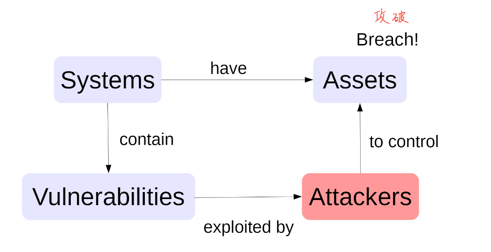

# Cybersecurity

## Module 1 principles of cybersecurity

 The security related to computers or computer network

Cybersecurity 分为两个部分

- Security- Protection of assets，system,secrets
- Privacy- Protection of identity, behavior, expression
  - 表达的权力
  - 选择how people see you的权利
  - control info about you的权利

security的价格是昂贵的

### Principles of CIA

##### Confidentiality 机密性

Information is secret

The ability of a system to ensure that an asset is viewed only by authorized parities

例子：

- password被盗
- 如果一个hacker没有阅读secret info，但是他们有这么做的priviledge，这个会被认定成违反机密性吗？答案是不违反。具体来说比如他们可能得到你系统的root，and they‘re using it to make your computer a bot for the botnet, rather than your  secret info that would violate Integrity
- Eavesdropper窃听者在玩家登录时capture 账号和密码

##### Integrity 完整性

Information/System is correct

The ability of a system to ensure that an asset is modified only by the authorized parities 

例子： 

- 密码被篡改
- Man-in-the-middle: Attacker 代替用户和系统连接
- 钱被偷（online），但是如果是用户forced to shut down的servise则是违反了availability

##### Availiability 可用性

system is usable 

The ability of a system to ensure that an asset can be used by any authorized parties ，有些时候可用性和前两项是不可分割的，尤其是完整性，在很多情况下完整性被影响就会影响到可用性

例子：

- 密码被篡改
- Man-in-the-middle ，导致用户无法通过自己的密码登录系统

**Perfect CI** is achieveable by shutting down the system, not allowing anybody to access it (not available to anyone)

=> CIA principle is a tradeoff between C,I,A

###### DDOS 分布式拒绝服务攻击

多个不同machines被用一个攻击者控制，攻击相同的services- 这种情况违反了avaliablity

攻击者使用了一个通过猜测微不足道的远程访问密码创建的僵尸网络 the attacker used a botnet that was created by guessing trivial remote access passwords- 这种情况违反了integrity， 物联网设备加入僵尸网络，这些设备的所有者不应该这样做（不违反机密性：usename&password不包含任何机密信息b/c这些物联网没有要求用户更改默认用户名和密码）

Assets: the items you value. There are  many types of assets involving hardware,sofeware,data,people processes pr conbinations of these.

Assets' values are personal ,time dependent, and often imprecise. 不精确的

###### Vulnerabilities 漏洞

如果你不知道用户的需求，你就无法证供的从创建一个成功的安全系统

分为两种情况

- Design
  - Wrong threat model: misunderstand, where the attacker come from(少见，因为公司的安全团队会防范)
    - 可以通过社会工程学攻击
  - Wrong user model: misunderstand what users are doing/who is the user
    - eg: giving administrative permission 比如在操作时软件申请root权限，很少有人会拒绝
  - 以上这两点did not design for security
- Implementation
  - 代码，硬件，网络等出现错误

Spiderman Rule： 能力越大责任越大

###### Privacy

- 隐私性不同于confidentiality ,我的理解是privacy是个人信息相关，而confidentiality是non-private的信息
  - 违反隐私的情况是： Welcome back ,customer. last week yoy purchased......(shopping list)
  - 违反confidentiality的情况是：Welcome back ,customer. As a reward,please use this gift code for your next purchase， 在这种情况下gift code 不是private or personal info
- The connectuon between Information and Identity
  - issues(human issues): expression, socla vulnerability,  behavorial analysis, discrimination判别
  - Protections： Anonymization匿名，disassociation分离（解除动作与人的关联disassociating the action with the perso），security

###### Defensive Strategy

###### 一些小单词：

Compromised 遭受入侵

Eavasdropper 窃听

sms= short message service 短讯服务

cyberbully 网络欺凌, cyberstalking 网络跟踪
