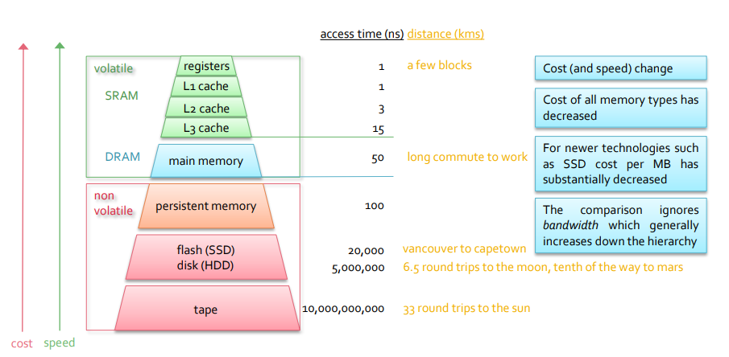
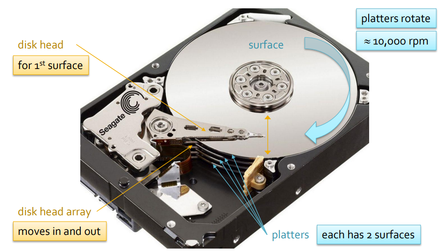

## Disk

#### 数据库基础知识复习

Relational model 包括 Entities,relationships,Attritubes

Database table：

- Rows： 代表每一个records
  - 每一个record都是unique的
  - represent as Tuples
- Column：代表Attritubes
  - have unique name
  - a Domain

A table is an instance of a schema（架构）

Schema就是CREATE TABLE这些，其中包含primary key etc

### Memory

Persistent storage 永久存储

虽然数据需要永久存储，但是所有的操作都在memory中进行

##### Secondary Memory

- Hard disk drives HDDS
  - 慢，便宜，相对不可靠
- Solid state drives SSDs
  - 相比较于硬盘更快更贵

##### Tertiary Memory

脱机储存，大容量低成本比如cd tape

##### Persistent memory

持久内存是非易失性RAM（随机存储其器，直接与CPU交换数据），也称为

- NVM–非易失性存储器
- NVRAM–非易失性RAM
- SCM–存储类内存

特点

- 字节可寻址
- 持久的

类型

- NVDIMM-N

  - DRAM与带电池的闪存配对
  - 与DRAM性能相似
  - 容量小且相对昂贵
- NVDIMM-F

  - 使用DRAM总线的闪存存储
  - 比DRAM慢，更接近闪存性能
  - 容量大，价格便宜

### HDDs

以bit单位储存，分组为byte

一些名词：

surface：磁盘的面，通常一个磁盘有两个面，两个都可以储存数据

Platters：磁盘本人，一个硬盘四个

Track：轨道，可以根据角度分成sectors

Cylinder：所有surface上同一直径上的track的轨道集，通常在追踪track的时候也用cylinder表示。

disk head：磁盘读取头，每一面都有一个head。移动单位为disk head array。

###### Reading

Queryc处理器request a record- 由buffer mananger 接手request-在读取的时候 整个block都会被读取到main  memory

在磁盘中read& write的单位是BLOCK -  a block contains multiple records

###### Writing

先读后写-可以以单个record的方式写入

###### Accessing Data

* 想要找到access 的data，磁盘需要旋转到磁盘头可读的位置，找寻block所在的track的时间为SEEK TIME
  * min seek time =0
  * average seek time=1/3 max seek time
  * unit as ms
* 等待block的边缘旋转到磁头的时间为Rotational Delay
  * Average Rotational Delay=1/2 Max Rotational Delay
  * Max Rotational Delay = 1/(#of RMP/60s per min)* 1000
  * unit as ms
* 阅读整个block的时间为 Transfer Time
  * Transfer Time= Rotational delay/ #of block in a track
  * unit as ms
* Access Time
  * equals to reading time
  * = seek time+ rotational delay+ transfer time
  * 在read相邻的block时 阅读时间只增加transfer time
  * 在read不相邻track的两个block时就是一个阅读时间*2
  * access优先级是： 同一个block；相邻的block：同一个track：~~同一个cylinder的不同track~~：相邻的cylinder
  * （上面划线的地方是我说写错了 应该是same track different cylinder- 这也是我对cylinder理解的误区）

###### Buffering data

将数据从存储转移到memory

- minimum transfer unit is BLOCK

###### Disk Request - blocks读取顺序的几种方法

FIFO

- 先request的block就先读取
- 性价比比较低 时间消耗长

Elevator

- 先阅读**同一方向**的data
- 包括多种变形（稍后添加）
- 比FIFO性能更好
- avoid starvation

Shortest-seek

- 先阅读与上一个已读block最近的目标
- 性能也比FIFO好
- cost starvation

#### RAID

Checksums- 附加位

每个扇区包含附加位，其值基于扇区中的数据位；

0- 偶数

1-基数

使用单个校验和位只允许可靠地检测一个位的错误，可以维护多个校验和位，以减少未能注意到错误的可能性

##### Multiple Disks

###### Striping

数据划分单位；either block or bit

在RAID系统中使用 Round Robin 算法分布

Bit striping

分布方式：D1b1r1，D2b2r1，D3b3r1........

    以record为单位

Block striping

分布方式：D1B1，D2B2,D3B3......

##### Introduction

Redundancy 冗余

通过储存冗余数据来提高数据的可靠性，在这里冗余数据可以用来重建丢失数据

有两种方法，一种是镜像，一种是parity scheme（checksum）

RAID系统由多个磁盘组成，其作用就是用来提高可靠性（冗余）和性能（通过使用striping）

##### Level 0

和普通disk的构建一样，四个磁盘通过striping排列

- 没有redundancy所以可靠性差
- 读写功能良好
- 最便宜

##### Level 1 Mirrored

每个磁盘都有个相同的副本，但是不通过striping排列

- 读取性能类似于single disk，random read性能还行
- 写入性能差
- 可靠但是成本高

##### Level 10 Striping+mirror

Striping排列with镜像磁盘

- read性能与level0 相似
- 比起single disk sequential和random read性能都快两倍
- 写入技能和level 1 一样差

level1 和10 之所以写作性能很差 是因为其存在冗余数据存储

- 普通数据和冗余数据的写入不是同时进行的
- 包括带有校验位的系统需要先读取这个然后再进行普通数据的写入
- bit striping 的随机和顺序写入，block striping的顺序写入

  - 使用先读后写的方法写入所有数据
  - 然后重新计算校验位
  - 在写入新的校验位来检查磁盘
- block striping随机写入

  - single disk 先读后写
  - 阅读校验盘并且重新计算
  - 最后写入检验
- sequential reads

  - block和bit striping的表现通常没有差别
- random reads

  - block striping的效率更高
    - 通过位条带化，必须读取所有D磁盘才能重新创建数据文件的单个记录（和块）
    - 通过块分条，完整记录存储在一个磁盘上，因此只需要一个磁盘即可满足随机读取通过位条带化，必须读取所有D磁盘才能重新创建数据文件的单个记录（和块

##### Level 2 Memory Style Error Correcting Code

bit striping，使用允许识别故障磁盘的方案

- 只能承受单个磁盘的丢失
- 增加了所需的磁盘数量

##### Level 3 Byte Interleaved Parity

bit striping，多一个磁盘

- 随机读写性能差
- 需要D+1 disk
- 只能承受单个磁盘的丢失

##### Level 4 Block Interleaved Parity

Block striping，使用一个包含奇偶校验数据的冗余磁盘

- 顺序读取性能好
- 随机读取的性能非常好
- D times fast
- 随机写入的性能差（因为由专业检查盘
- 接受一个drive丢失

##### Level 5 Block interleaved distributed Parity

解决Level 4 中的Random write 问题, 没有专用的检查磁盘，但在所有磁盘上分发奇偶校验数据

- 随机写入性能相对提高
- 读取性能略微提高
- 顺序读写类似于 Level 4
- 接受一个drive丢失

##### Level 6 P+Q Redundancy

可以处理多个磁盘崩溃，有两组校验数据，在四个磁盘中一般的数据是奇偶校验数据。随着磁盘的增加Redundant数据减少 六个盘

- 读取性能类似于Level 5
- 写入低于level 5
- 两组奇偶校验数据位于不同的磁盘上
  - 这要求每个磁盘都有一个读-修改-写周期

##### RAID排序

其中有几点特点： 首先，带有检查盘的随机写入功能都很差，然后带有block striping的随机阅读能力跟高，然后 24是35的低阶版本

Random Read：

- Level 5 > Level4 >Level 10 > Level 0 > Level 2 > level 3

Sequence Read:

- Level 4,5 > Level 1,0,10 > Level 2,3

Random Write：

- Level 0 > Level 1,10 > Level 5 > Level 4 > Level 2,3

Sequence Write:

- Level 4,5

### Record and Page Formate

##### 数据组织

Attributes = fileds

数据存储在Page中，固定大小的单位

Page包含了:

* page header: 管理数据
* Slots：每个slots包含一个record

RID： record 的id，使其唯一标识，通常由page#和slots#组成 Ex：RID：123，2

Record分为 固定大小和变换大小两种

- Fixed Length
  - Relative Location： ex： find filed3 = base address + size（filed1）+ size（filed2）
  - Field 的个数和大小都是固定的
  - 在page中有两种排列方式
    - Packed拥挤的
      - 简单好找，但是移动记录会耗时并且使得RID失效
    - Bit Array
      - header包括一个bit array 用来记录那个slots中存储了数据
      - 不需要重新排列数据但是监管力度大
- Variable Length
  - 方案一 是在每个field之后增加分割符号（delimiters）
  - 方案二 是在record header中储存其他数据
  - 存储数据的方式
    - 包含一个slots目录，每个是一个pair包括了纪录offset和长度
    - 可以自由移动
    - 灵活的
    - 相比于fixed length更加复杂

##### Large Fields- 不适合单个页面的数据 （LOB 大对象数据类型）

- 大型数据，图片视频等等
- 可以转换成二进制数据或者字符 BLOB，CLOB
- 储存在连续pape中

#### Files

包含相关记录的页面被组织成file

一个table代表一个File

##### Heap File

没有任何排序方式，它们保证可以通过重复请求下一条记录来检索文件中的所有记录

因为是linear search所以效率低下

两种组织：

- Linked list
- Directory

#### Buffer Management

buffer pool： 主内存的合集

buffer manager负责将数据从磁盘中带到内存

* page映射到frames

Page请求步骤:

- 首先在main memory frame 中包括
  - dirty bit： 如果页面modified 则为1
  - pin count： 释放页面时递减
- 如果page已经在buffer pool中，则增加pin count
- 如果有空frame，则将page放入其中并且设定pin count为 1
- 如果没有空frame，则寻找pool中 pin count 为0的框架并且将page替换
  - 如果没有pin为0 的情况则需要等待或者终止

buffer 替换原则：

- Random
- FIFO
- LRU：least recently used（clock replacement）
  - 开销比较小
  - 采用的是一个循环链表，有一个指针指向最早的对象，且每个缓存中的对象都维护一个标记位。
  - 没有队列但事实设置frame的编号从0-B-1 B是frame数
  - 每个frame都有一个引用位，当读取或者访问时设置为0
  - 当前变量最初为0，用于显示要考虑替换的下一帧current variable最初为0，
  - 替换步骤：没看懂 ppt还得改 93页
- MRU

Sequential Flooding 顺序泛滥- 就是buffer pool满了的情况

假如说有十个位置 分别放置了page 1-10 然后等待要放置p11，要先read page1-10然后等待阅读p11

后面都重新学好了 明天再说 真正不明白了

### SSDs

固态硬盘使用NAND闪存，访问SSD不需要寻道时间或旋转延迟，因此速度要快得多

NAND闪存

- 一次只能读写一页数据
- 多级电池（MLC）、三级电池（TLC八个电荷，3 个bit）、四级电池（QLC）写入能力较差，寿命较短
- 单层电池（SLC 两个电荷 一位bit）成本最高
- HDD相比，读写速度都更快，性能提高最大的是随机读取
- 闪存在写入之前必须擦除， 必须擦除整个块

## File Storage and Indexing

对于Heap文件来说 因为是无序的所以查找文件的方式只有scan的file

##### Sorted Files

通过Sort key排序，插入或者删除都会导致数据移动

##### Hash Files

可以用来快速访问单个记录

###### Bucket：

哈希函数将记录的字段映射到存储该记录的blocks就是 buckets

- hash index 不能用于范围搜索
- 哈希文件支持基于哈希键高效地搜索、插入和删除记录

###### Keys

sort key：A key used to order a sequential file

Search key：用于在索引中查找记录的键

###### Type of index：

primary index： an index on an ordered file，在这种情况下sort key和search key相同，sort可以有重复（这里老师特意强调了是老师自定的定义，通常定义是primary key是 unique的）

- 可以是dense or sparse
- 对于Dense（密集的）来说，一个record就是一个block 就有一个index，还可以使用二进制搜索
- Sparse： 只有当数据文件按索引的搜索键排序时，才可能使用稀疏索引
  - 稀疏索引包含数据文件中每个记录块的一个数据项

clustered index：和primary相似 但是可以有重复的sort key value

Secondary Index: Also referred to as unclustered

- 辅助索引的搜索键不是文件的排序键
- Also referred to as unclustered
- 最好不是松散的

## B+ Tree

##### 插入

- a b d 中要插入c ，这种情况下需要split的时候或者中数后一位！ 即使有中数也是一样

##### 删除

删除涉及到移位置的问题

只要是涉及floored（n+1）/2 就要移位置

如果不满足移动位置的条件就需要 合并
