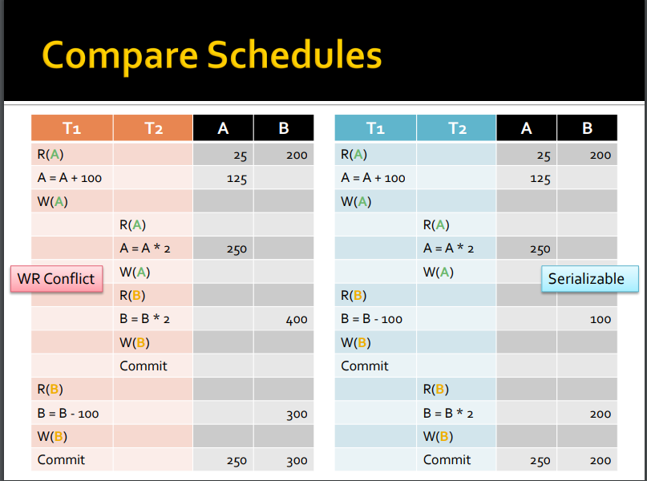

# Transactions

事务（Transaction）是由一系列对系统中数据进行访问或更新的操作所组成的一个程序执行逻辑单元（Unit）

##### ACID Principle

###### Atomic

原子性（Atomicity）：即不可分割性，事务中的操作要么全不做，要么全做

- 涉及两个操作：中止，提交
  * **中止** ：如果事务中止，则看不到对数据库所做的更改。
  * **提交** ：如果事务提交，则所做的更改可见。

###### Consistency

一致性（Consistency）：一个事务在执行前后，数据库都必须处于正确的状态，满足[完整性约束](https://baike.baidu.com/item/%E6%95%B0%E6%8D%AE%E5%AE%8C%E6%95%B4%E6%80%A7%E7%BA%A6%E6%9D%9F)

- 假设用户A和用户B两者的钱加起来一共是700，那么不管A和B之间如何转账，转几次账，这一约束都得成立，即事务结束后两个用户的钱相加起来还得是700，这就是事务的一致性。

###### Isolation

隔离性（Isolation）：多个事务并发执行时，一个事务的执行不应影响其他事务的执行

- 对于任意两个并发的事务T1和T2，在事务T1看来，T2要么在T1开始之前就已经结束，要么在T1结束之后才开始，这样每个事务都感觉不到有其他事务在并发地执行

* 两个并发的事务应该不能操作同一项数据。数据库管理系统通常使用锁来实现这个特征。
* 在一个事务执行过程中，数据的中间的（可能不一致）状态不应该被暴露给所有的其他事务。

###### Durability

持久性（Durability）：事务处理完成后，对数据的修改就是永久的，即便系统故障也不会丢失

是指一个事务一旦提交，对数据库中对应数据的状态变更就应该是**永久性**的。即使发生系统崩溃或机器宕机等故障，只要数据库能够重新启动，那么一定能够根据事务日志对未持久化的数据重新进行操作，将其**恢复**到事务成功结束的状态。

## Concurrency并发

##### Scheduler 调度器

调度器是负责执行读写的进程

- an action include read, write, commit, or abort
- 一个serial schedule可以包含多个数据

##### Serializable Schedule可串行

**可串行化**是一个调度，即多个事务之间的执行方式；而多个事务之间的执行有个先后顺序，如果事务之间没有共同的操作对象（读或写操作），则事务之间的执行顺序前后置换是没有关系的；但是如果事物间存在共同的操作对象，则事务间先后执行的顺序则需要区分；

- order不一样会得到不一样的结果
- serial 代表串行不并行
- serial和Serializable是不同的意思
- 可串行不代表可并行（action可交叉

Conflict分为三种： 

- WR： Write-read conflicats
  - 一个事物写入数据，第二季事务在提交之前提取该数据
  - **Dirty read**

对于T1和2 的两种order所得到的结果都不属于conflict的答案所以产生了conflict

- RW： read- write conflicts
  - 一个事物读取数据，然后由第二个事物写入。
  - unrepeatable read
- WW： write-write condlicts
  - 一个事物写入第二个不完整事物已经读取或者写入的数据
  - lost update
  - 也涉及blind write

##### Conflict equivalence冲突等价

冲突可串行化(conflict serializable)：一个 schedule能将冲突的操作调节成类似串行化的操作。

###### view equivalance视图等价

- 对同一 data item， 只要是有一个 schedule读了它的初始值，另外一个 schedule 也必须读它的初始值。
- 对同一data  item,如果在一个 schedule 里，一个操作是读了一个写操作后的值，另一个 schedule 也必须读同样写操作后的值。
- 对同一 data item,如果在一个 schedule 里最后进行了写操作，则另一个 schedule 也要在最后进行同样的写操作。
- 说直白一点就是有ABC这几个元素需要操作 他们的initial read需要在一个T中实现。 final write 依然需要在同一个T中实现

如果三条规则都满足，才能认为两个 schedule 是视图等价的。

###### Conflict equivalance冲突等价

- 冲突等价一定是视图等价的
- precedence无环

###### Aborted Transaction

如果一旦事物进入abort中止状态则所有数据返回事务操作前的状态

- T1在T2提交前abort会导致两个事务的结果都丢失
- T1在T2提交后abort 那么两个事务的结果都要reverse
- 以上两种情况是基于T1在T2操作前，T2的action要基于T1结果的基础上

### Locking Protocols

锁，作用在被操作的数据元素之上，是控制并发访问数据的一个工具 。

- 每一个数据元素都有一个锁，事务需要先向调度器申请获取锁，获取锁之后才能对数据进行读、写操作，操作完之后要释放锁。
- 如果一个事务对某一个数据元素加了锁(排它锁），其他事务只能等待该锁的释放，延迟了对该数据元素的读写操作。所以， **调度器是可以使用锁来保证冲突可串行性的** 。
- 锁的类型

  - shared lock  S读锁： 一个事务加了共享锁之后，其他事务仍然可以对该数据元素加共享锁，也就是所有事务都可以读该数据元素，但都不可以写。
  - Exculsive locks X 写锁：一个事务对数据元素加排它锁之后，只有该事务可以读、写；其他任何事务都不能再加排它锁，也就不可以读、写。更新
  - Update locks：初始是读锁，以后可以升级为写锁。为了避免读锁升级写锁过程中产生死锁问题，可以使用更新锁。
  - Incremental locks： 增量更新时候使用该锁，比如i=i+x;操作，如果一个事务对i变量增量加x；其他事务对该变量增量加y，这些操作之间顺序是可以交换的。

##### 2PL two-phase locking 

操作和锁的对应关系很简单：如果一个transaction想要读取 x ，那它必须获取 x 上的shared lock；如果一个transaction想要写入 x ，那它必须获取 x 上的exclusive lock。

- 如果一个transaction释放了它所持有的 **任意一个锁** ，那它就 **再也不能获取任何锁** 。
- 在2PL协议下，每个transaction都会经过两个阶段：
  - 在第一个阶段里，transaction根据需要不断地获取锁，叫做  ***growing phase (expanding phase)*** ；
  - 在第二个阶段里，transaction开始释放其持有的锁，根据2PL的规则，这个transaction不能再获得新的锁，所以它所持有的锁逐渐减少，叫做  ***shrinking phase (contracting phase)*** 。
- 2PL ensures that precedence graphs are acyclic
- 除了unrecognizable（在最后被about和commit 穿插的情况下）都能阻止

##### Strict Two-Phase Locking Protocal

严格两阶段锁协议，除了满足2PL的要求外，加了另外的限制：

* 要求排它锁不能在事务提交（或撤销）之前释放；
* 必须在事务提交（或者撤销）之后，同时释放所有锁

##### Locking in B+ tree
