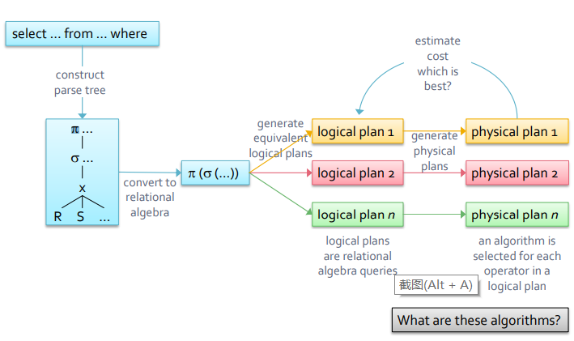
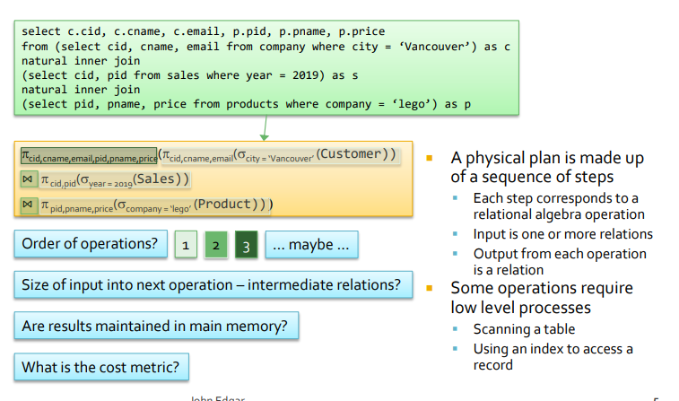
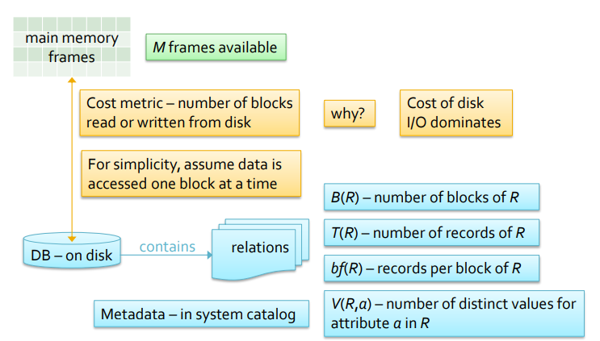
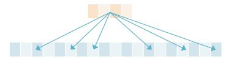
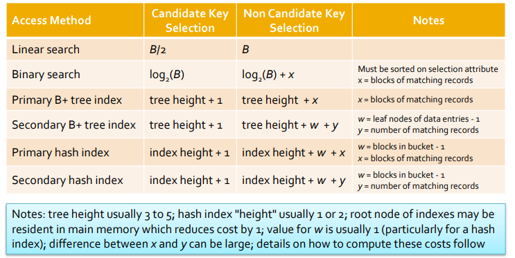
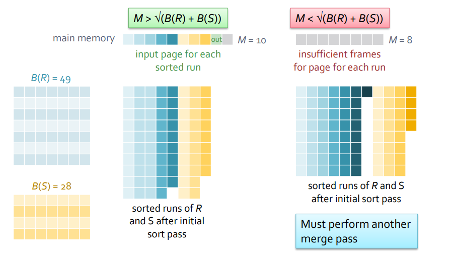

# Other Indexes and Evaluation of Selections

## Skiplists

##### Optimized index structure for disk access

基本特点：

    运行相对简单

    快速的inset和delete算法

    Used by MemSQL

    在并发性方面具有优势

#### Skiplist- multiple levels of linked lists

- lowest level 按照顺序包含所有Keys
- higher level包含上一级别的一半的keys数量
  - 作为向下一级的索引
  - 运行时间O(logn)，包含range search
  - 如果元素x出现在第i层，则所有比i小的层都包含x；

Sorted Linked Lists

- inefficient 虽然是Dynamic 但是运行时间是O(n)

##### Searching

- skiplists search 一个level最多可以访问两个node
- start at top level
  - If current node == target go to bottom level and return record
  - If target < next key go down level and repeat
  - If target >=next key go right and repeat
  - If at lowest level linear search until target found or passed

##### Insertion

- 插入和删除都是problematic的，成本高昂因为要确保1/2的元素在下个level，可能需要重新排列整个列表
- Solution – relax the requirement
- Each level is expected to have ½ the nodes of the previous level
- ▪ On insertion a node is copied to the higher level with probability of 0.5
  - ▪ A randomized data structure – two skiplists with the same data inserted in the same order may differ

实际操作:

- Insert into lowest level first
- Then roll dice to see if value is inserted into higher levels
- Keep track of path to lowest levels (the visited nodes) to insert higher level nodes

##### Removal

- Removal is straightforward
  - If the entry has a tower of nodes remove the entire tower
  - Like insertion, the nodes in the search path need to be retained in the processRemoval is straightforwar

## Specialized Index Techniques

There are a number 0f specialized indexes:

- 通常与满足条件复杂的查询相关
  - 带连词和/或析取的Where子句
  - 可能涉及多个属性
- Geographic information systems
  - 部分匹配查询
  - 范围查询
  - 最近邻查询
- OLAP databases
  - 多维数据查询

##### Multiple Key Index

使用常规索引可以满足条件复杂的查询

- 通过使用复合搜索键创建索引
- 或者通过使用多个索引，检索RID并选择其交点
- 或用于析取的并集

An alternative is to create a multiple key index

- 一个属性上的索引构建在另一个属性上的索引之上
- 第一个索引是指第二个属性上的索引页
  - 对于与第一个索引不同的搜索键值，可以重复较低索引中的搜索键值

Multiple key indices work well for **range queries**

But do not support queries where data for the first attribute is missing

An alternative is a kd tree

##### kd tree

k维搜索树是用于多维数据的内存结构

- They generalize a binary search tree
- 小于节点值的值位于其左子树中
- 大于节点值的值位于其右子树中
- kd tree nodes contain an attribute name and an associated value

The levels rotate through the attributes of the tree

- With two attributes, the levels alternate between the attributes

##### Bitmap Indices

- Bitmap indices通常用于数据库中的数据挖掘和OLAP
  - Which often have low cardinality attributes
  - 变化相对较少
- Bitmap indices由多个位向量组成
  - 属性的每个可能值都有一个向量
  - A bitmap to record if a patient was a smoker would require two bit vectors
  - A bitmap on birth year might require 100 bit vectors
  - The I th bit of the index is set to 1 if the I th row of the table has the vector’s value for the attribute
- A bitmap index can speed up queries on sparse columns, that have few possible values
  - One bit is allocated for each possible value
- Use indices to answer queries

# Query Optimaization

##### Query Model and Metrics

Computation Model

This section covers algorithms for query operations(often more than one query)

- 单独考虑operations
- 假设数据是从磁盘读取的；实际上，情况并非总是如此，结果保留在内存中，而不是写出来

##### Unary Operators

一元运算符是具有单个操作数的运算

For SQL operators the operand is a table

- Either a base table or the result of a previous query
  - Either a base table or the result of a previous query operation

包括：

###### Selection

 A simple selection has a single condition

- 通过访问路径检索匹配的记录来满足选择
- 扫描文件并测试每条记录，以确定其是否与所选内容匹配
- 如果文件已排序且没有索引，则使用二进制搜索
- 在条件中的属性上使用索引

cost：

- No index on the selection attribute
  - Linear search by scanning file, cost is B reads
  - 如果选择属性是候选键，则一旦找到匹配项，即可终止扫描(cost is B/2)
  - If the file is sorted use binary search to find record （▪ log2(B) + pages of matching records - 1）
- Index on the selection attribute
  - The cost is dependent on

    - The type of index – B+ tree, hash index, …
    - The height of the index
    - 与所选内容匹配的记录数
    - 索引是主索引还是次索

Cost of using an Index：

- The cost of satisfying a selection with an index is composed of
  - Number of disk reads to use the index
    - i.e. to reach the leaf / bucket that contains the data entry
    - The number of leaves / size of the bucket
  - Number of blocks of the file with records that match the selection
    - Generally larger if the index is secondary
- Assume that indices are
  - Hash index – extensible or linear
  - B+ tree index

Cost to Search Index

- B+ Tree
  - To find matching RIDs search tree
  - RIDs reside in leaf nodes
  - ***Cost:*** 1 disk read per level
- Additional leaf pages may have to be read
  - 如果索引密集或selection不平等
    - selection
- Extensible hash index
  - 读取目录
    - Probably 1 or 2 blocks
  - Read bucket(one block)
- Linear hash index
  - Read bucket
    - Bucket may have overflow blocks
  - Hash indexes only used for equality selections

Cost to Read Records

- Primary index
  - 文件按search key搜索排序
  - 在连续blocks中存储匹配的记录
  - Blocks read is number of records / records per block
    - 1 + [(records – 1) / bf(R)] (upper bound)
    - Assumes worst case

- Secondary index
  - 匹配的记录不会连续存储
  - 假设每个匹配记录读取一个磁盘
  - 因为记录分散在文件中
  - 对于较大的选择，可能比文件扫描更糟糕

###### Complex Selection

A complex selection is made of at least two terms connected by and (^) and or (v)

- The terms can reference different or the same attributes
- Conjunctions are more selective (and)
- Disjunctions are less selective (or)

Complex selections的满足方式与 simple selections的满足方式大致相同

- If no index on any of the selection attributes scan the file
- Use indices on selection attributes where possible
- 索引的使用取决于selection和索引的类型

###### Selections with no Disjunctions

- 如果只有一个索引可用，请使用该索引并在主存中应用其他选择
  - Either there is an index on only one of the attributes
  - 或具有引用多个选择属性的复合键的索引
  - 注意哈希索引的使用限制
- If multiple indexes are available
  - Either use the most selective
  - Or collect RIDs from leaves or buckets of indexes and take the intersection
- Selections with disjunctions are stated in conjunctive
  normal form (CNF)
  - A collection of conjuncts
  - Each conjunct consists either of a single term, or multiple terms joined by or
  - (A^ B) v C v D 三 (A v C v D) ^ (B v C v D)
  - 这允许独立考虑每个连接
- A conjunct can only be satisfied by indices if there is an index on all attributes of all of its disjunctive terms
  - If all the conjuncts contain at least one disjunction with no matching index a file scan is necessary
- Consider a selection of this form
  - Where each of a to f is an equality selection on an attribute
- If each of the terms in either of the conjuncts has a
  matching index
  - Use the indexes to find the rids
  - Take the union of the rids and retrieve those records
  - For example, if there are indexes just on a, b, c, and e
  - Use the a, b, and c indexes and take the union of the rids
  - Retrieve the resulting records and apply the other criteria

## External sorting

在读取时对数据进行排列时有必要的

- 使用Order BY
- ways to sort :
  - Main memory sorting
  - B+ tree index
  - mult-way mergesort

#### Naive External Merge Sort

对Disk data使用 merge sort

- Initial Step- read 2 pages of data from file
  - 排序之后写入硬盘
  - 得到一个B/2的结果
- 

## Projections

projection and deplicate

##### Sort Projection

- 读取M页并删除不需要的属性
- 对记录进行排序，并删除所有重复项
- 将排序后的运行写入磁盘
- 对文件的其余部分重复此操作，总成本为2B
- 根据需要对第一阶段的输出执行合并过程
  - 删除遇到的任何重复项
  - 如果只需要一个合并过程，则成本为≈ 1B
- 总成本为≈ 3B

##### Hash Projections

分为两个stages

- Partitioning
  - 使用哈希函数h划分为M-1个分区
  - 每个分区有一个输出缓冲区和一个输入缓冲区
  - 文件一次读取一页到主存，每个记录都散列到适当的缓冲区
  - Output buffers are written out when full
- Probing
  - 这个阶段的目的是消除重复，会用到第二个hash function
  - h2 函数用于reduce main memory costs
    - 该函数会构造一个in-memory hash table
    - 当两个record hash到了相同位置时检查他们是否重复，可以使用in-memory sorting 来删除重复项
    - 如果在分区阶段生成的每个分区都可以放入主内存，那么成本是
      - 分割阶段：2B
      - 重复消除阶段：B，总成本为3B
      - 这与使用排序的投影成本相同

比较sort和hash

- 成本相同为3B
- hash projection可以区分不同的table
- 

## Joins

Cartesian Product：设D1、...、Dn是n个域。D1、...、Dn上的笛卡尔乘积定义为集合 D1×...×Dn ={ (d1 , ..., dn ) | di ∈Di，1≤i≤n }。

EX:  D1={我，你} D2={他，她}

D1xD2：{我，她}，{我，他}, {你, 他}.....

Join: 跟随selection的Cartesian Product，selection作为join的条件

#### Join的几种类型：

Nature Join： 融合两个tables通过相同的attritubes name 和datatype

Inner Join：两个table重合的数据，会返回包含所有属性的来自于这两个table的相同的colums

#### Nested Loop Joins

有三种nested loop joins的算法，用来比较来自不同表的数据是否相同

* Tuple nested loop join

  1. cost= B(R) + (T(R) * B(S))
  2. 一次读取 one page of R，scan S 然后将R中的每个record和S中的每个record作比较，最后返回的结果排序和R相同
  3. 进阶版本 就是扫描和对比同时进行，运行时间是Cost = B(R) + (B(R) * B(S))
  4. 需要两个input buffer和一个output buffer
* Block Nested Loop Join

  1. 相比于上一个算法，这个算法更高效的方法是通过增大input buffer for R，将外层循环的行/结果集存入join buffer, 内层循环的每一行与整个buffer中的记录做比较，从而减少内层循环的次数（老师的方法我不太懂  所以就直接看网上了）
  2. 举例来说 加入在join buffer中放入十条记录，然后innerloop时可以直接匹配这十行，这是效率就是simple的十倍
  3. 需要加东西
* Index Nested Loop Join

  - 对于内层表使用index，通过外层表匹配条件直接与内层表索引进行匹配
  - 使用条件是内表层的colmn 具有index

#### Sort-Merge Join

Assume that both tables to be joined are sorted on the join attribute联接属性排序

- The tables may be joined with one pass
  - The tables may be joined with one pass
  - cost= B（R）+ B（S）
- 原则是读取R和S- join on X
- 当Xr!=Xs
  - 如果Xr小于Xs， 移动到下一个R
  - else， 移动到下个S
- 当Xr==Xs
  - 连接 r and s， 然后
  - 添加到output buffer
- 重复直到所有record都被读到

The sort-merge join结合了join操作和external merge sort

- 第一个过程对大小为M的R和S进行排序，在这个过程中R和S独立处理
- 通过external merge sort处理R and S，直到排序的运行总数小于M
  - 如果M较大或R和S较小，则可能不需要此步骤
- 通过比较R和S的运行，将external merge sort的最终合并阶段与连接相结合
  - 不满足连接条件的记录将被丢弃
  - 满足条件的记录被连接并输出

##### 内存需求

如果主内存足够，可以在两个过程中执行排序合并连接

成本为3(B(R) + B(S))

主内存必须足够大，以允许R和S的每次排序运行都有一个输入缓冲区

- 主内存必须大于 根号下(B(R) + B(S))在两个过程中执行连接
  - initial pass produces B(R) / M + B(S) / M sorted runs of size M
  - 如果M大于根号下(B(R) + B(S))，那么B(R) / M + B(S) / M必须小于M

### zig-zag join
