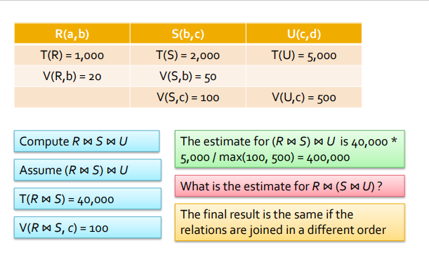
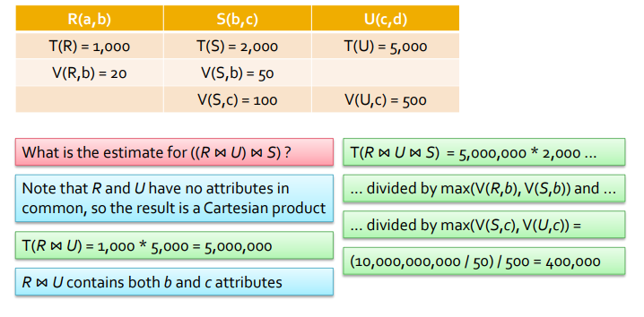
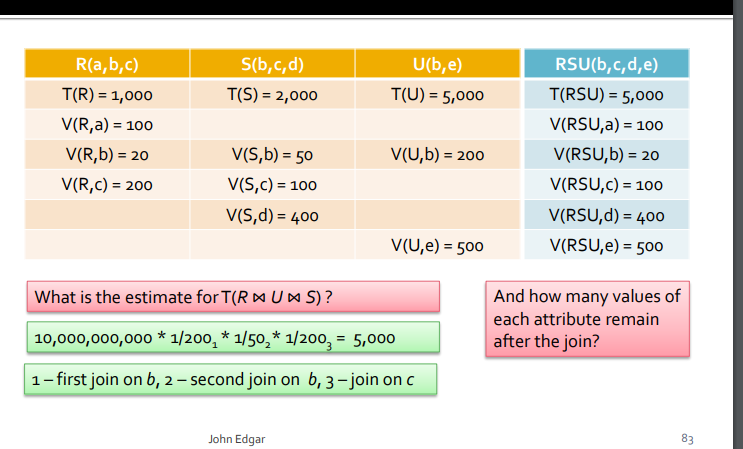
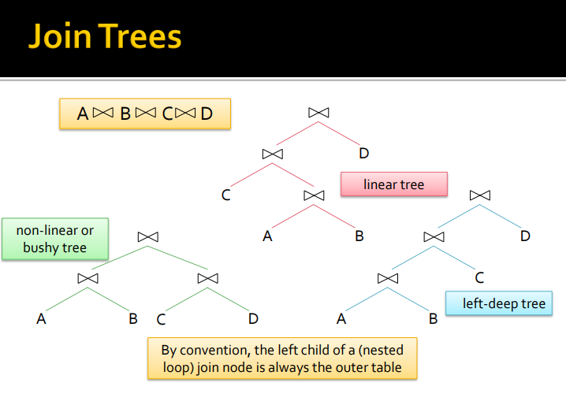
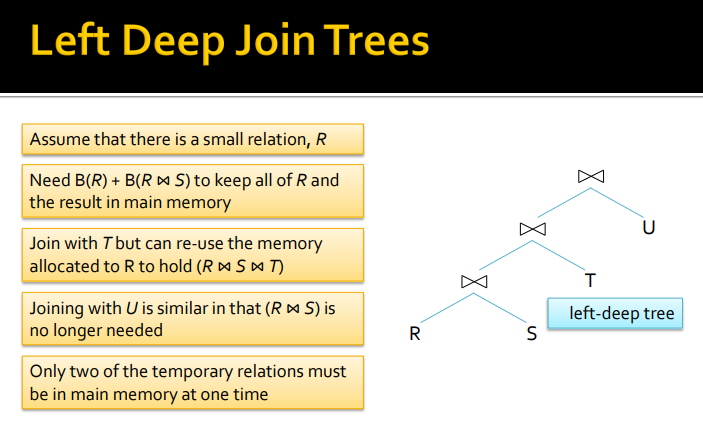
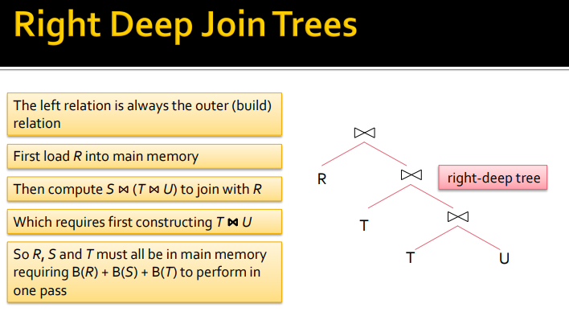
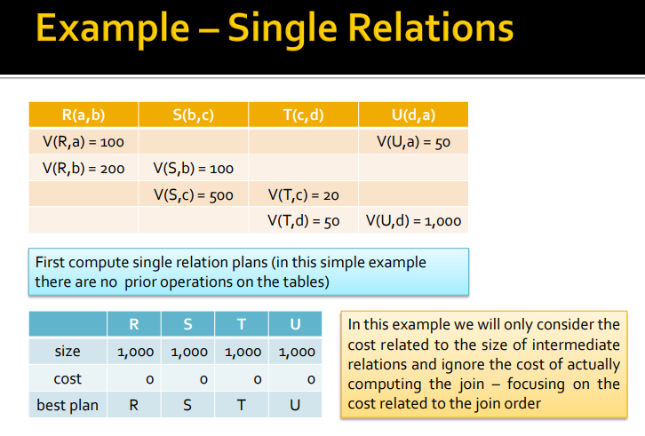

# Query Optimization - Size Estimation and Join Order

## Estimating Relation Size

##### 逻辑到物理计划

对于从逻辑计划导出的每个物理计划，我们记录

- An order and grouping for operations such as joins, unions and intersections
- 逻辑规划中每个运算符的算法
- 物理计划所需的其他操作员
- 参数从一个运算符传递到下一个运算符的方式

##### 估计规则

估计结果大小所需的信息存储在system catalog中

估计大小的规则有三个： 精确的，  易于计算 和 逻辑一致性

目的是将最低成本分配给最佳计划，估计是否准确并不重要

##### Projections

Projections 后关系的大小可以根据关系的信息进行估计，其中包括属性的数量和类型

- **Sum of (column sizes) * estimated number of records**

##### Selections on Equality

选择会减小结果的大小，但不会减小每个记录的大小

如果属性是一个可预估的常数则大小为：

- T(S) = T(R) / V(R,A)
  - 其中S是选择的结果，T（R）是记录数，V（R，A）是属性A的值计数

##### Zipfian Distribution

假设一个属性的值出现的频率相同可能是不正确的，许多属性的值遵循zipfian分布

- The frequency of the ith most common item is proportional to 1/根号下i
  - 例如，如果最常见值出现1000次，则第二常见值出现1000次/根号下2=707次

##### Selections on Inequality

一个简单的规则是估计平均有一半的记录满足一个选择，或者，估计不等式返回三分之一的记录

- Alternatively assume：T(R) * (V(R,A) – 1 / V(R,A))

##### And and OR

对于AND子句，将选择视为选择的级联（cascade)

- 为每个选择应用selectivity factor或者 OR clauses
- 假设没有记录同时满足这两个条件

  - 结果的大小是每个单独条件的结果之和，或者假设选择是独立的
  - result = n*(1 – (1 – m1/n)*(1 – m2/n)),其中R有n个元组，m1和m2是满足每个条件的分数

##### 估计natural join 大小

假设一个自然连接在一个公共属性的等式上，称之为x，

- 这两个关系可以有不相交的x集， 连接为空，T（R⋈ S） =0
- x可能是S的键和R中的外键，T(R ⋈ S) = T(R）
- 在R和S的大多数记录中，x可能是相同的， T(R ⋈ S) ≈ T(R) * T(S）

##### Assumption

- Containment of value sets

  - 如果x出现在多个关系中，则其值位于固定列表x 1、x 2、x 3。。
  - 系从列表的前面获取值，并在前缀中包含所有值
  - 如果R和S包含x和V（R，x）≤ V（S，x）那么R的x的每个值也将在S中
- Preservation of value sets

  - 如果R连接到另一个关系，并且y不是连接属性，则y不会丢失值
  - 也就是说，如果y是R的属性，但不是S的属性，则nV（R⋈ S、 y）=V（R，y）
- r的记录（r）和s的记录（s）在某个x值上一致的概率是多少？

  - Assume that V(R,x) >= V(S,x)
  - 根据包含假设，S的x值必须出现在R中
  - x值相同的概率为1/V（R，x），类似地，如果V（R，x） 那么r的Y值必须在S中，所以几率为1/V（S，x）
  - 一般来说，概率为1/max（V（R，x），V（S，x））
  - **So T（R⋈ S） =T（R）*T（S）/最大值（V（R，x），V（S，x））**

由多个属性组成的自然连接是带有AND子句的等分连接

▪ 因为两个属性的值必须相同，记录才能符合条件

 使用相同的折减系数

▪ 最大值（V（R，x），V（S，x））

▪ 并应用于**每个属性**

##### 估计其他join种类

equijoin等分连中的记录数可以像自然连接一样计算，除了变量名的不同。 其他θ连接可以估计为选择，然后是笛卡尔乘积

▪ 关系中记录数的乘积

###### Joins of many relations

可以对许多关系的连接执行相同的计算,需要注意的是，连接属性的值的数量在连接中会发生变化

- 保留假设仅适用于非连接属性
- R和S在x上连接后
- V（R）⋈ S） =最小值（V（R，x），V（S，x））

其他operation

Union

▪ Bag–参数大小的总和

▪ Set–介于大小总和和较大参数的大小之间

Intersection

▪ 从零到较小参数的大小

set difference

▪ 对于R–S，在T（R）和T（R）–T（S）之间

 Duplicate elimination

▪ 在T（R）（无重复项）和1（所有重复项）之间

▪ 上限是所有V（r，ai）的乘积

Grouping and aggregation

记录的数量等于组的数量

▪ 与重复移除一样，所有V（r，ai）的乘积是上限

## Join Orders

Mutiple Relation queries

- 需要连接或笛卡尔乘积的查询可能很昂贵
  - 无论连接顺序如何，都可以估计最终结果的大小（使用可用的统计信息）
  - 然而，根据连接关系的顺序，中间关系的大小可能会有很大差异
- 如果一个查询涉及两个以上的表，则可以通过多种方式连接它们
  -  许多查询优化器只考虑左深连接树

##### Right and left arguments

- 许多连接算法是不对称的
- 这些连接的成本取决于哪个表在连接中扮演什么角色
- 这适用于哈希连接、块嵌套循环连接、索引嵌套循环连接
- 我们可以对左右参数进行假设
- Nested loop joins嵌套循环连–左侧是外部关系
- Index nested loop joins索引嵌套循环联接–右侧有索引

在这个式子下有多少种排列方式？ 

- 对于每个可能的树形状，都有n！可能的方式
- 如果Tr（n）是可能的树形数，则：
  - **Tr(1) = 1, Tr(2) = 1, Tr(3) = 2, Tr(4) = 5, Tr(5) = 14 , Tr(6) = 42**
- 然后必须乘以关系在树上分布的方式数
- 4relations表示5种可能的形状，因此5*4！=120棵可能的树
- 如果n=6，则有42*6！=30240棵可能的树，其中720棵为深树

##### Left-Deep join Tree

如果所有正确的子树都是叶子，则二叉树是左深的

- 左深树的数量很大，但不如所有树的数量大
- 因此，通过只考虑左深树，我们可以显著限制对较大查询的搜索
- 左深树与常见算法配合良好（Nested-loop joins, and hash joins
- 在左深树中，右节点是叶子
- 这意味着右节点始终是基表， 或其他非连接操作的结果
- 左深的树经常产生有效的计划
  - 连接中较小的关系应位于左侧
  - 左深度连接树导致在主内存中保留的关系更少
  - 并带来更大的管道化机会

如果连接树的每个连接的右节点都是一个表，就是左深树

如果连接树的每个连接的左节点都是一个表，就是右深树

##### Join的顺序

当连接多个表时，可能会产生许多不同的连接顺序

- 选择连接顺序有三种选择
  - 考虑所有连接顺序
  - 考虑连接顺序的子集
  - 使用一些启发式方法来选择连接顺序
- 一种方法是使用动态规划
  - 记录成本表
  - 只保留得出结论的最小数据

###### 动态规划数据

- 选择连接订单记录
  - 连接关系的估计大小
  - 计算连接的最小成本
  - 成本最小的表达式
  - 表达式可以限制为左深度平面

在本例中，我们将只考虑与中间关系大小相关的成本，而忽略实际计算连接的成本——重点是与连接顺序相关的成本
